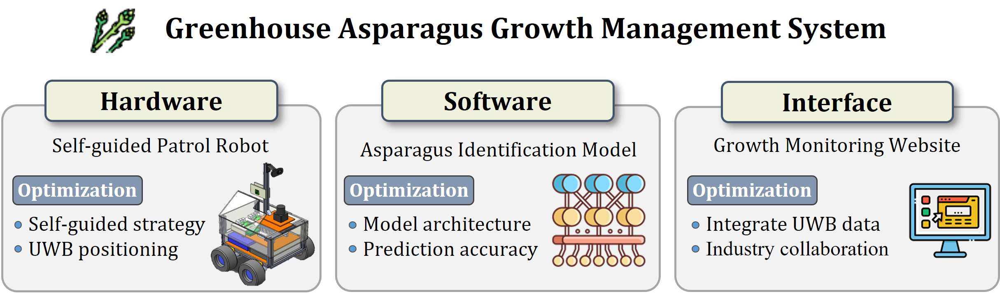

## Hi there 👋

# Research Project Overview
My research project consists of three main components:

## 1. Hardware

A self-guided patrol 4-wheel robot, featuring AGX Xavier computing and Raspberry Pi for motor control.

### [AGX Xavier](https://github.com/rayhuangg/Asparagus_Car)
- Fuses front-view images (using ENet model) and 2D LiDAR data (using HDBSCAN clustering) for self-guided lane centering
- Implements UWB technology for indoor positioning

### [Raspberry Pi](https://github.com/rayhuangg/Asparagus_Car_RPi)
- Controls the robot's motors

### [Automatic Robot Trajectory Evaluation Algorithm](https://github.com/rayhuangg/Research_Code)
- Assesses and analyzes the robot's movement paths

## 2. Software

Deep learning asparagus identification models (Instance segmentation), comparing two approaches:

### [Mask DINO](https://github.com/rayhuangg/Asparagus_MaskDINO)
- A transformer-based model
- Higher capability to learn complex features in asparagus growth images

### [Mask R-CNN](https://github.com/rayhuangg/Asparagus_MaskRCNN)
- Traditional R-CNN model for comparison

### [Dataset Preparation](https://github.com/rayhuangg/COCO_dataset_generate)
- Generates COCO format datasets
- Serves as input for Detectron2 (PyTorch) models

## 3. Interface

A Django-based web application:

### [Greenhouse Asparagus Growth Management System](https://github.com/rayhuangg/Asparagus_web)
- User-friendly interface for monitoring and managing asparagus growth

📫 How to reach me: [ray00211@gmail.com](ray00211@gmail.com)

<!--

- 🔭 I’m currently working on ...
- 🌱 I’m currently learning ...
- 👯 I’m looking to collaborate on ...
- 🤔 I’m looking for help with ...
- 💬 Ask me about ...
- 📫 How to reach me: ...
- 😄 Pronouns: ...
- ⚡ Fun fact: ...
-->
